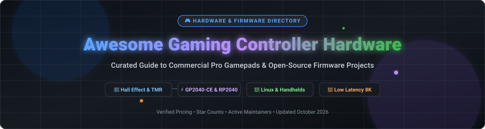

  

# 🎮 Awesome Gaming Controller Hardware & Open-Source Firmware ⚡

**A comprehensive, curated directory of commercial pro-grade gaming controllers, custom hardware modding components, and open-source gamepad firmware projects.**

*Specialized focus on Hall Effect magnetic sticks, TMR (Tunnel Magnetoresistance) sensors, back paddles, instant trigger stops, ultra-low-latency 8K polling, and RP2040 custom firmware.*

📅 **Last updated: October 2026**

---

## 🌟 Overview & Highlights

This repository tracks notable **gaming controller hardware** and **open-source firmware projects** that maximize gaming performance, repairability, and customization options. Whether you are a competitive esports gamer choosing a pro controller or a DIY enthusiast building a custom fightstick, this list covers the entire spectrum.

- 🎮 **Commercial Pro Controllers**: From default console gamepads to elite tournament controllers featuring Hall Effect drift-free thumbsticks and 8,000 Hz polling rates.
- 🔓 **Open-Source Firmware & Remappers**: Community-driven projects like **GP2040-CE**, **InputPlumber**, and **AntiMicroX** providing low-latency multi-platform input translation.

---

## 📖 Table of Contents

- [📊 Market Overview & SaaS Analysis](#-market-overview--saas-analysis)
- [🎮 Commercial & SaaS Controller Solutions](#-commercial--saas-controller-solutions)
- [🔓 Open-Source Firmware & Software Projects](#-open-source-firmware--software-projects)
- [🤝 How to Contribute](#-how-to-contribute)
- [☕ Support & Sponsorship](#-support--sponsorship)
- [⭐ Star History](#-star-history)
- [⚠️ Disclaimer & Risk Notice](#️-disclaimer--risk-notice)

---

## 📊 Market Overview & SaaS Analysis

> **📈 Sector Dynamics**: The global gaming controller and input peripheral market is estimated at **~$8.2 Billion in 2026**, projected to reach **~$15.4 Billion by 2032** (CAGR ~6.8%). The market is **moderately fragmented**. First-party console platform holders (**Microsoft**, **Sony**, **Nintendo**) hold strong hardware market share, while premium third-party brand ecosystems (**Razer**, **Corsair/Scuf**, **Logitech**, **8BitDo**, **GuliKit**) compete heavily in the high-performance tier. Companion software suites (like Razer Synapse and Corsair iCUE) operate on a hardware-tied SaaS/freemium model where desktop app features are unlocked per connected device.

---

## 🎮 Commercial & SaaS Controller Solutions

Below is the comparative list of commercial gaming controllers and integrated companion software platforms, sorted by **Company Revenue / Valuation (Descending)**:

| Controller & Platform | Description & Key Features | Starting Tier Pricing 🏷️ | Free Tier / Trial Limits 🎁 | Company Revenue / Valuation 🏢 |
| :--- | :--- | :--- | :--- | :--- |
| **[Xbox Wireless Controller & Accessories App](https://www.xbox.com/en-US/accessories/controllers/xbox-wireless-controller)** 🎮 | **The default PC and Xbox gamepad standard.** Hybrid D-pad, textured grips, Bluetooth + 2.4G wireless, 3.5mm jack. Accessories App handles button remapping. | **$55.54** (Standard Wireless) / **$79.99** (X25 Special Edition) | **Free Forever**: Xbox Accessories App features 100% free with any Xbox controller; no profile limits. | **~$281 Billion** *(Microsoft FY2025 revenue)* |
| **[DualSense Wireless Controller & PC App](https://direct.playstation.com/)** 🕹️ | **Sony's PS5 controller with adaptive triggers & haptic feedback.** Dual actuators, integrated microphone, touchpad, gyro motion sensing. | **$65.00** (Standard White/Black) / **$84.00** (Limited Editions) | **Free Forever**: PlayStation Accessories PC App free with unlimited firmware updates & trigger calibration. | **~$30 Billion** *(Sony Gaming FY2025 revenue)* |
| **[Nintendo Switch Pro Controller](https://www.nintendo.com/)** 🍄 | **Nintendo's flagship gamepad with HD Rumble & amiibo NFC support.** 40-hour battery life, ergonomic grip, motion controls. | **$32.00** (Refurbished) / **$69.99** (New Standard / Zelda Edition) | **Free Forever**: Integrated Switch System controller settings free; 0 subscription fees for hardware profiles. | **~$12 Billion** *(Nintendo FY2025 revenue)* |
| **[Razer Wolverine V3 Pro & Controller App](https://www.razer.com/)** ⚡ | **Competitive pro controller with TMR thumbsticks & 8K polling.** 6 remappable action buttons, instant trigger stops, Razer Controller App setup. | **$109.99** (Woot Sale) / **$169.99** (V3 Tournament) / **$249.99** (V3 Pro) | **Free Forever**: Razer Controller App PC & Xbox download free with unlimited profile customization & lighting setups. | **~$1.5 Billion** *(Razer FY2025 revenue)* |
| **[Logitech F310 & G HUB](https://www.logitech.com/)** 🕹️ | **Reliable budget PC gamepad with classic console-style layout.** Floating D-pad, XInput/DirectInput toggle, 1.8m wired USB cable. | **$25.00** (F310 Wired) / **$49.99** (F710 Wireless) | **Free Forever**: Logitech G HUB software is 100% free with unlimited G-shift macros & cloud profile sync. | **~$1.5 Billion** *(Logitech FY2025 revenue)* |
| **[Scuf Instinct Pro & Corsair iCUE](https://www.scufgaming.com/)** 🏆 | **Esports standard for Xbox & PC.** 4 embedded back paddles, instant mouse-click triggers, swappable thumbsticks & magnetic faceplates. | **$163.90** (Refurbished) / **$219.99** (Base Instinct Pro) | **Free Forever**: Hardware onboard memory remapping free; Corsair iCUE software free for lighting & macro mapping. | **~$1.46 Billion** *(Part of Corsair Gaming FY2025)* |
| **[SteelSeries Stratus+ & GG Software](https://steelseries.com/)** 📱 | **Multi-platform mobile & PC controller with Hall Effect sensors.** Bluetooth 5.0, 90-hour lithium battery, phone mount included. | **$15.00** (Clearance Sale) / **$59.99** (Standard MSRP) | **Free Forever**: SteelSeries GG & Engine app free with full button binding & stick deadzone customization. | **~$400 Million** *(SteelSeries estimated valuation)* |
| **[8BitDo Ultimate & Ultimate Software](https://www.8bitdo.com/)** 👾 | **Third-party Wireless controller with Hall Effect sticks & charging dock.** 2.4G + Bluetooth, 2 custom back paddle buttons, macro support. | **$66.48** (Ultimate 2.4G) / **$99.99** (Ultimate 3) / **$149.99** (Ultimate 3E) | **Free Forever**: 8BitDo Ultimate Software (iOS/Android/PC) free with up to 3 onboard custom profile slots. | **~$150 Million** *(Private 8BitDo estimated valuation)* |
| **[GuliKit KingKong 2 Pro](https://www.gulikit.com/)** 🧲 | **Pioneer in anti-drift electromagnetic Hall Effect joysticks.** 1000Hz wired polling, auto-pilot macro recording button, amiibo NFC reader. | **$69.00** (KingKong 2 Pro) / **$79.99** (KK3 Max) | **Free Forever**: On-board hardware adjustment (no software installation required, zero tier restriction). | **~$50 Million** *(Private GuliKit estimated valuation)* |
| **[PowerA Enhanced Wired Controller](https://www.powera.com/)** 💵 | **Officially licensed budget controller for Xbox Series X\|S & Switch.** Dual rumble motors, 2 mappable back buttons, 3.5mm headset jack. | **$16.99** (Standard Wired) / **$27.99** (Enhanced Edition) | **Free Forever**: PowerA Gamer HQ App free download for Xbox & Windows 10/11 controller testing & calibration. | **~$40 Million** *(Private PowerA / ACCO Brands segment)* |

---

## 🔓 Open-Source Firmware & Software Projects

Sorted by **GitHub Stars_Count (Descending)**:

| Repository & Project | Description & Key Capabilities | GitHub Stars_Count ⭐ |
| :--- | :--- | :--- |
| **[DS4Windows](https://github.com/Ryochan7/DS4Windows)** 🎮 | **Windows driver and utility for Sony DualShock 4 & DualSense gamepads.** Emulates Xbox 360 controller, key mapping, touchpad navigation, and LED customize. |  |
| **[AntiMicroX](https://github.com/AntiMicroX/antimicrox)** ⌨️ | **Graphical mapping software for keyboard buttons & mouse controls to gamepads.** C++ based, supports profile switching, gyro, rumble, Linux, Windows, SteamOS. |  |
| **[GP2040-CE](https://github.com/OpenStickCommunity/GP2040-CE)** ⚡ | **Multi-platform open-source gamepad firmware for RP2040 & Raspberry Pi Pico.** Ultra-low latency (<1ms), web configuration interface, arcade stick & analog support. |  |
| **[BetterJoy](https://github.com/Davidobot/BetterJoy)** 🍄 | **Driver for Nintendo Switch Pro Controllers, Joy-Cons, and SNES controllers on PC.** Emulates Xbox 360 input with motion control support for Cemu/Yuzu. |  |
| **[xpadneo](https://github.com/atar-axis/xpadneo)** 🐧 | **Advanced Linux kernel driver for Xbox One & Xbox Series wireless controllers over Bluetooth.** Enables force feedback rumble, trigger rumble, battery level reporting. |  |
| **[InputPlumber](https://github.com/ShadowBlip/InputPlumber)** 🛠️ | **Linux input router and remapper daemon.** Combines multiple input devices (gamepads, keyboards, mice) for Linux gaming handhelds like Steam Deck, Legion Go, MSI Claw. |  |
| **[OpenSplitDeck](https://github.com/tommybee456/OpenSplitDeck)** 📐 | **Modular open-source wireless split gamepad inspired by Steam Controller.** Features dual trackpads, nRF52840 microcontrollers, magnetic charging, 3D printable chassis. |  |
| **[xpad](https://github.com/paroj/xpad)** 🔌 | **Linux USB driver for Xbox / Xbox 360 / Xbox One gamepads.** Maintains compatibility and force feedback support across Linux kernel builds. |  |

---

## 🤝 How to Contribute

We welcome contributions from competitive gamers, DIY hardware builders, and firmware developers! 🚀

1. 🍴 **Fork** this repository.
2. 📝 **Add or edit** entries in `README.md` maintaining table formatting.
3. 📌 **Include**: Project Name, URL, concise description, verified pricing, and repository Stars_Badge.
4. 🚀 **Submit a Pull Request** with a descriptive title.

---

## ☕ Support & Sponsorship

Thank you for visiting and using this resource! If you find this repository helpful for finding gaming hardware or building custom controllers, please consider supporting the project:

- ⭐ **Star** this repository to help others discover it.
- 🔄 **Share** it with fellow gamers, modders, and developers.
- 💖 **Sponsor**: Buy me a coffee or support ongoing open-source hardware research via [GitHub Sponsors](https://github.com/sponsors/ishandutta2007).

---

## 📈 Star History

---

## ⚠️ Disclaimer & Risk Notice

- ℹ️ This project is a **community-curated directory** for educational and reference purposes.
- ⚡ Installing third-party open-source firmware or flashing custom microcontrollers carries risks of bricking hardware or voiding manufacturer warranties.
- 🔒 Trademarks (Xbox, PlayStation, Nintendo, Razer, Logitech, Corsair) belong to their respective corporate owners.

---

  <b>Crafted with ❤️ for competitive gamers, DIY modders, and open-source input developers worldwide.</b>

